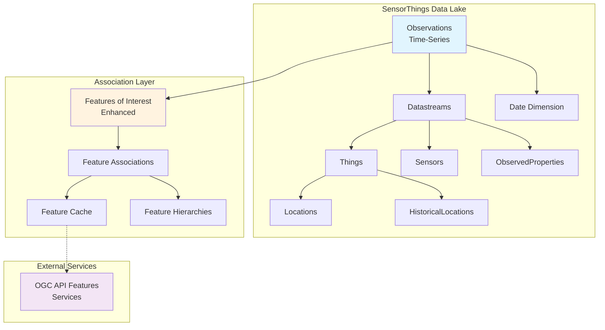

# SensorThings API MongoDB Data Lake Schema with OGC API Features Integration

## Table of Contents
- [Overview](#overview)
- [Architecture](#architecture)
- [Core SensorThings Collections](#core-sensorthings-collections)
  - [Observations (Time-Series)](#1-observations-time-series-fact-collection)
  - [Date Dimension](#2-date-dimension-collection)
  - [Datastreams](#3-datastream-dimension-collection)
  - [Things](#4-things-dimension-collection)
  - [Sensors](#5-sensors-dimension-collection)
  - [Observed Properties](#6-observedproperties-dimension-collection)
  - [Locations](#7-locations-collection)
  - [Historical Locations](#8-historical-locations-collection)
- [Feature Association Collections](#feature-association-collections)
  - [Features of Interest](#9-enhanced-features-of-interest-collection)
  - [Feature Associations Registry](#10-feature-associations-registry)
  - [External Feature Cache](#11-external-feature-cache)
  - [Feature Hierarchies](#12-feature-hierarchies)
- [Supporting Collections](#supporting-collections)
- [Integration Patterns](#integration-patterns)
- [Query Examples](#query-examples)
- [Performance Considerations](#performance-considerations)
- [Installation & Setup](#installation--setup)

## Overview

This document describes a comprehensive MongoDB schema implementation for the OGC SensorThings API v1.1 specification, designed as a data lake architecture with full support for associating sensor observations with external geospatial features through the OGC API - Features standard.

### Key Features
- ✅ Full OGC SensorThings API v1.1 compliance
- ✅ MongoDB time-series collections for 90% storage reduction
- ✅ Integration with external OGC API Features services
- ✅ Hierarchical spatial relationships (graph-like structure)
- ✅ Performance-optimized with intelligent caching
- ✅ Support for temporal, spatial, and semantic associations
- ✅ Data warehouse-style date dimensions

### Design Principles
1. **Loose Coupling**: SensorThings and Features data lakes remain independent
2. **Performance First**: Leverages MongoDB time-series and strategic denormalization
3. **Standards Compliance**: Maintains compatibility with OGC specifications
4. **Semantic Richness**: Supports complex relationships similar to RDF/SKOS
5. **Scalability**: Designed for billions of observations

## Architecture



## Core SensorThings Collections

### 1. Observations Time-Series Fact Collection

The core collection using MongoDB's native time-series functionality for optimal storage and query performance.

```javascript
// Create time-series collection
db.createCollection("observations", {
  timeseries: {
    timeField: "phenomenonTime",
    metaField: "datastream",
    granularity: "seconds"
  },
  expireAfterSeconds: 31536000 // 1 year TTL (optional)
})

// Document structure
{
  phenomenonTime: ISODate("2025-01-15T14:30:00.123Z"),
  datastream: {
    datastreamId: "DS-001",
    thingId: "THING-001", 
    sensorId: "SENSOR-001",
    observedPropertyId: "PROP-001",
    locationId: "LOC-001",
    unitOfMeasurement: {
      name: "degree Celsius",
      symbol: "°C",
      definition: "http://unitsofmeasure.org/ucum.html#para-30"
    }
  },
  result: 23.5,
  resultTime: ISODate("2025-01-15T14:30:00.523Z"),
  resultQuality: "good",
  validTime: {
    start: ISODate("2025-01-15T14:30:00Z"),
    end: ISODate("2025-01-15T15:30:00Z")
  },
  featureOfInterestId: "FOI-001",
  parameters: {
    calibrationDate: ISODate("2024-12-01"),
    accuracy: 0.1
  },
  // Denormalized fields for performance
  date_key: 20250115, // FK to date dimension
  hour_bucket: 14,
  location: {
    type: "Point",
    coordinates: [-114.133, 51.08]
  }
}

// Indexes
db.observations.createIndex({"datastream.datastreamId": 1, "phenomenonTime": -1})
db.observations.createIndex({"datastream.thingId": 1, "phenomenonTime": -1})
db.observations.createIndex({"datastream.observedPropertyId": 1, "phenomenonTime": -1})
db.observations.createIndex({"location": "2dsphere"})
db.observations.createIndex({"date_key": 1, "datastream.datastreamId": 1})
db.observations.createIndex({"featureOfInterestId": 1, "phenomenonTime": -1})
```

### 2. Date Dimension Collection

Comprehensive date dimension for business intelligence queries.

```javascript
// date_dimension collection
{
  _id: 20250115, // YYYYMMDD format
  full_date: ISODate("2025-01-15T00:00:00Z"),
  
  // Standard temporal attributes
  year: 2025,
  quarter: 1,
  month: 1,
  week: 3,
  day: 15,
  
  // Descriptive attributes
  month_name: "January",
  month_abbr: "Jan",
  day_name: "Wednesday",
  day_abbr: "Wed",
  
  // ISO week dates
  iso_week: 3,
  iso_year: 2025,
  iso_day_of_week: 3,
  
  // Relative positioning
  day_of_week: 3,     // 1=Monday, 7=Sunday
  day_of_month: 15,
  day_of_quarter: 15,
  day_of_year: 15,
  week_of_month: 3,
  week_of_year: 3,
  
  // Business calendar
  is_weekday: true,
  is_weekend: false,
  is_holiday: false,
  holiday_name: null,
  is_business_day: true,
  fiscal_year: 2025,
  fiscal_quarter: 3,
  fiscal_month: 7,
  
  // Additional attributes
  days_in_month: 31,
  is_leap_year: false,
  is_last_day_of_month: false,
  season: "Winter",
  
  // Relative offsets
  days_from_today: 0,
  weeks_from_today: 0,
  months_from_today: 0,
  quarters_from_today: 0
}

// Indexes
db.date_dimension.createIndex({"year": 1, "month": 1, "day": 1})
db.date_dimension.createIndex({"iso_week": 1, "iso_year": 1})
db.date_dimension.createIndex({"fiscal_year": 1, "fiscal_quarter": 1})
```

### 3. Datastream Dimension Collection

Links observations to their measurement context.

```javascript
// datastreams collection
{
  _id: "DS-001",
  name: "Building A Temperature Stream",
  description: "Temperature measurements from main lobby sensor",
  observationType: "http://www.opengis.net/def/observationType/OGC-OM/2.0/OM_Measurement",
  
  // Foreign keys
  thingId: "THING-001",
  sensorId: "SENSOR-001",
  observedPropertyId: "PROP-001",
  
  // Embedded frequently accessed data
  unitOfMeasurement: {
    name: "degree Celsius",
    symbol: "°C",
    definition: "http://unitsofmeasure.org/ucum.html#para-30"
  },
  
  // Spatial and temporal extents
  observedArea: {
    type: "Polygon",
    coordinates: [[[-114.133, 51.08], [-114.130, 51.08], 
                   [-114.130, 51.085], [-114.133, 51.085], 
                   [-114.133, 51.08]]]
  },
  phenomenonTime: {
    start: ISODate("2024-01-01T00:00:00Z"),
    end: null // Still active
  },
  resultTime: {
    start: ISODate("2024-01-01T00:00:00Z"),
    end: null
  },
  
  // SCD Type 2 tracking
  valid_from: ISODate("2024-01-01T00:00:00Z"),
  valid_to: ISODate("9999-12-31T23:59:59Z"),
  is_current: true,
  version: 1,
  
  // Metadata
  properties: {
    measurementInterval: 60, // seconds
    accuracy: 0.1,
    precision: 0.01,
    calibrationFrequency: "monthly"
  },
  
  created_at: ISODate("2024-01-01T00:00:00Z"),
  updated_at: ISODate("2024-01-01T00:00:00Z")
}

// Indexes
db.datastreams.createIndex({"thingId": 1})
db.datastreams.createIndex({"sensorId": 1})
db.datastreams.createIndex({"observedPropertyId": 1})
db.datastreams.createIndex({"is_current": 1, "_id": 1})
db.datastreams.createIndex({"observedArea": "2dsphere"})
```

### 4. Things Dimension Collection

Physical or virtual IoT devices.

```javascript
// things collection
{
  _id: "THING-001",
  name: "Weather Station Alpha",
  description: "Outdoor environmental monitoring station",
  
  // Current location (denormalized)
  currentLocation: {
    locationId: "LOC-001",
    name: "Building A Rooftop",
    encodingType: "application/vnd.geo+json",
    location: {
      type: "Point",
      coordinates: [-114.133, 51.08]
    }
  },
  
  // Properties and metadata
  properties: {
    deploymentDate: ISODate("2024-01-01"),
    manufacturer: "SensorTech Inc",
    model: "WS-2024",
    serialNumber: "WT20240001",
    firmwareVersion: "2.1.3",
    status: "active",
    maintenanceSchedule: "quarterly"
  },
  
  // Related entities
  datastreamCount: 5,
  activeDatastreams: ["DS-001", "DS-002", "DS-003"],
  
  created_at: ISODate("2024-01-01T00:00:00Z"),
  updated_at: ISODate("2025-01-15T00:00:00Z")
}

// Indexes
db.things.createIndex({"currentLocation.location": "2dsphere"})
db.things.createIndex({"properties.status": 1})
db.things.createIndex({"name": "text", "description": "text"})
```

### 5. Sensors Dimension Collection

Instrument metadata.

```javascript
// sensors collection
{
  _id: "SENSOR-001",
  name: "TH-2024 Temperature/Humidity Sensor",
  description: "High-precision environmental sensor",
  encodingType: "application/pdf",
  metadata: {
    type: "datasheet",
    url: "https://sensors.example.com/datasheets/TH-2024.pdf",
    specifications: {
      temperatureRange: {min: -40, max: 85, unit: "°C"},
      humidityRange: {min: 0, max: 100, unit: "%"},
      accuracy: {
        temperature: "±0.1°C",
        humidity: "±2%"
      },
      resolution: {
        temperature: 0.01,
        humidity: 0.1
      }
    }
  },
  
  properties: {
    manufacturer: "SensorTech Inc",
    model: "TH-2024",
    calibrationRequired: true,
    calibrationInterval: 180, // days
    communicationProtocol: "MQTT",
    powerRequirement: "3.3V DC"
  },
  
  // Usage tracking
  datastreamCount: 12,
  lastCalibration: ISODate("2024-12-01T00:00:00Z"),
  nextCalibration: ISODate("2025-06-01T00:00:00Z"),
  
  created_at: ISODate("2024-01-01T00:00:00Z"),
  updated_at: ISODate("2024-12-01T00:00:00Z")
}

// Indexes
db.sensors.createIndex({"encodingType": 1})
db.sensors.createIndex({"properties.manufacturer": 1, "properties.model": 1})
db.sensors.createIndex({"nextCalibration": 1})
```

### 6. ObservedProperties Dimension Collection

Phenomena being measured.

```javascript
// observed_properties collection
{
  _id: "PROP-001",
  name: "Air Temperature",
  definition: "http://www.qudt.org/qudt/owl/1.0.0/quantity/Instances.html#AirTemperature",
  description: "Temperature of the ambient air",
  
  // Category for grouping
  category: "Environmental",
  subcategory: "Temperature",
  
  // Valid measurement units
  validUnits: [
    {symbol: "°C", name: "degree Celsius"},
    {symbol: "°F", name: "degree Fahrenheit"},
    {symbol: "K", name: "Kelvin"}
  ],
  
  // Statistical properties
  typicalRange: {min: -50, max: 50, unit: "°C"},
  alertThresholds: {
    low: 0,
    high: 35,
    critical_low: -10,
    critical_high: 40
  },
  
  properties: {
    measurementType: "continuous",
    aggregationMethods: ["min", "max", "avg", "median"],
    isAdditive: false
  },
  
  created_at: ISODate("2024-01-01T00:00:00Z"),
  updated_at: ISODate("2024-01-01T00:00:00Z")
}

// Indexes
db.observed_properties.createIndex({"category": 1, "subcategory": 1})
db.observed_properties.createIndex({"name": "text", "description": "text"})
```

### 7. Locations Collection

Geographical positions.

```javascript
// locations collection
{
  _id: "LOC-001",
  name: "Building A - Rooftop",
  description: "Rooftop sensor installation point",
  encodingType: "application/vnd.geo+json",
  location: {
    type: "Point",
    coordinates: [-114.133, 51.08],
    elevation: 1102 // meters
  },
  
  // Location hierarchy
  hierarchy: {
    site: "Campus North",
    building: "Building A",
    floor: "Rooftop",
    zone: "Northeast Corner",
    room: null
  },
  
  // Address information
  address: {
    street: "123 Innovation Drive",
    city: "Calgary",
    state: "Alberta",
    country: "Canada",
    postalCode: "T2N 1N4"
  },
  
  // Associated things
  things: ["THING-001", "THING-002"],
  
  properties: {
    installationType: "permanent",
    accessibility: "restricted",
    powerAvailable: true,
    networkAvailable: true,
    environmentType: "outdoor"
  },
  
  created_at: ISODate("2024-01-01T00:00:00Z"),
  updated_at: ISODate("2024-01-01T00:00:00Z")
}

// Indexes
db.locations.createIndex({"location": "2dsphere"})
db.locations.createIndex({"hierarchy.building": 1, "hierarchy.floor": 1})
db.locations.createIndex({"things": 1})
```

### 8. Historical Locations Collection

Tracking Thing movements over time.

```javascript
// historical_locations collection
{
  _id: ObjectId("..."),
  thingId: "THING-001",
  locationId: "LOC-001",
  time: ISODate("2024-01-01T00:00:00Z"),
  
  // Snapshot of location at this time
  location: {
    type: "Point",
    coordinates: [-114.133, 51.08]
  },
  
  // Movement metadata
  movement: {
    reason: "Initial deployment",
    movedBy: "Installation Team",
    previousLocationId: null,
    distanceMoved: 0 // meters
  },
  
  created_at: ISODate("2024-01-01T00:00:00Z")
}

// Indexes
db.historical_locations.createIndex({"thingId": 1, "time": -1})
db.historical_locations.createIndex({"locationId": 1, "time": -1})
```

## Feature Association Collections

### 9. Enhanced Features of Interest Collection

The bridge between SensorThings and external geospatial features.

```javascript
// features_of_interest collection - Enhanced for external linking
{
  _id: "FOI-001",
  name: "Building A - Room 101",
  description: "Conference room in Building A associated with city parcel",
  
  // Standard SensorThings properties
  encodingType: "application/vnd.geo+json",
  feature: {
    type: "Feature",
    geometry: {
      type: "Polygon",
      coordinates: [[[-114.133, 51.080], [-114.132, 51.080], 
                     [-114.132, 51.081], [-114.133, 51.081], 
                     [-114.133, 51.080]]]
    },
    properties: {
      area: 45.5, // square meters
      height: 3.2, // meters
      occupancy: 12
    }
  },
  
  // External feature associations
  externalFeatures: [
    {
      // Primary association to OGC API Features
      featureId: "parcels/items/12345",
      featureAPI: {
        baseUrl: "https://geodata.city.gov/ogcapi",
        collection: "parcels",
        itemId: "12345",
        href: "https://geodata.city.gov/ogcapi/collections/parcels/items/12345",
        formats: ["application/geo+json", "application/gml+xml", "text/html"]
      },
      
      // Association metadata
      association: {
        type: "within",  // spatial relationship
        role: "container", // semantic role
        confidence: 1.0,
        establishedAt: ISODate("2024-01-15T00:00:00Z"),
        establishedBy: "cadastral_matching_service",
        validFrom: ISODate("2024-01-15T00:00:00Z"),
        validTo: null // still valid
      },
      
      // Cached feature metadata
      cachedMetadata: {
        lastFetched: ISODate("2025-01-10T00:00:00Z"),
        properties: {
          parcelNumber: "2024-B-12345",
          owner: "Municipal Government",
          landUse: "institutional",
          zoning: "P1",
          area: 4500.25
        },
        bbox: [-114.133, 51.080, -114.130, 51.085],
        updateFrequency: "monthly"
      }
    },
    {
      // Secondary association to building feature
      featureId: "buildings/items/BLD-2024-001",
      featureAPI: {
        baseUrl: "https://geodata.city.gov/ogcapi",
        collection: "buildings",
        itemId: "BLD-2024-001",
        href: "https://geodata.city.gov/ogcapi/collections/buildings/items/BLD-2024-001"
      },
      association: {
        type: "part_of",
        role: "building_component",
        floor: 1,
        confidence: 1.0
      },
      cachedMetadata: {
        lastFetched: ISODate("2025-01-10T00:00:00Z"),
        properties: {
          buildingName: "City Hall Annex A",
          floors: 5,
          yearBuilt: 1985,
          buildingType: "office"
        }
      }
    }
  ],
  
  // Hierarchical relationships
  hierarchy: {
    parents: [
      {
        level: "building",
        foiId: "FOI-BUILDING-A",
        name: "Building A"
      },
      {
        level: "campus",
        foiId: "FOI-CAMPUS-NORTH",
        name: "North Campus"
      }
    ],
    children: [
      {
        level: "sensor_location",
        foiId: "FOI-001-SENSOR-NE",
        name: "Northeast corner sensor mount"
      }
    ],
    semanticRelations: [
      {
        predicate: "sameAs",
        uri: "https://linkeddata.org/resource/room/CH-A-101",
        source: "organizational_linkeddata"
      },
      {
        predicate: "narrowerThan",
        uri: "https://vocabulary.org/building-spaces/conference-room",
        source: "domain_ontology"
      }
    ]
  },
  
  // Observation context
  observationContext: {
    primaryPurpose: "environmental_monitoring",
    relevantProperties: ["temperature", "humidity", "co2_level", "occupancy"],
    aggregationLevel: "room",
    representativePoint: {
      type: "Point",
      coordinates: [-114.1325, 51.0805],
      elevation: 1105.5
    }
  },
  
  // Statistics
  statistics: {
    observationCount: 1245000,
    firstObservation: ISODate("2024-01-15T00:00:00Z"),
    lastObservation: ISODate("2025-01-15T14:30:00Z"),
    averageObservationsPerDay: 3400,
    associatedDatastreams: 4
  },
  
  created_at: ISODate("2024-01-15T00:00:00Z"),
  updated_at: ISODate("2025-01-15T00:00:00Z"),
  tags: ["indoor", "controlled_environment", "public_building"],
  quality: {
    geometrySource: "building_plans",
    geometryAccuracy: 0.1, // meters
    lastValidated: ISODate("2024-12-01T00:00:00Z")
  }
}

// Indexes
db.features_of_interest.createIndex({"feature.geometry": "2dsphere"})
db.features_of_interest.createIndex({"externalFeatures.featureId": 1})
db.features_of_interest.createIndex({"externalFeatures.association.type": 1})
db.features_of_interest.createIndex({"hierarchy.parents.foiId": 1})
db.features_of_interest.createIndex({"hierarchy.children.foiId": 1})
db.features_of_interest.createIndex({"observationContext.relevantProperties": 1})
db.features_of_interest.createIndex({
  "externalFeatures.featureAPI.collection": 1,
  "externalFeatures.featureAPI.itemId": 1
})
```

### 10. Feature Associations Registry

Manages and validates feature associations.

```javascript
// feature_associations collection
{
  _id: ObjectId("..."),
  associationId: "ASSOC-2024-001",
  sourceType: "sensorthings_foi",
  sourceFOI: "FOI-001",
  
  // Target feature details
  targetFeature: {
    api: {
      endpoint: "https://geodata.city.gov/ogcapi",
      version: "1.0.0",
      conformance: [
        "http://www.opengis.net/spec/ogcapi-features-1/1.0/conf/core",
        "http://www.opengis.net/spec/ogcapi-features-1/1.0/conf/geojson"
      ]
    },
    collection: {
      id: "parcels",
      title: "City Parcels",
      description: "Cadastral parcels for the city",
      itemType: "feature",
      crs: ["http://www.opengis.net/def/crs/OGC/1.3/CRS84"]
    },
    feature: {
      id: "12345",
      href: "https://geodata.city.gov/ogcapi/collections/parcels/items/12345"
    }
  },
  
  // Association semantics
  semantics: {
    spatialRelationship: {
      type: "within", // within, intersects, touches, overlaps, contains
      verified: true,
      verificationMethod: "spatial_analysis",
      confidence: 0.98
    },
    thematicRelationship: {
      type: "ownership", // ownership, management, observation_target
      description: "FOI is within the legal boundaries of this parcel"
    },
    temporalRelationship: {
      type: "during", // before, after, during, overlaps
      valid: {
        from: ISODate("2024-01-15T00:00:00Z"),
        to: null
      }
    }
  },
  
  // Lineage and provenance
  lineage: {
    createdAt: ISODate("2024-01-15T00:00:00Z"),
    createdBy: "spatial_integration_service",
    method: "automated_matching",
    parameters: {
      algorithm: "point_in_polygon",
      tolerance: 0.1,
      crs_transformation: "EPSG:4326_to_EPSG:3857"
    },
    qualityMetrics: {
      spatialAccuracy: 0.15, // meters
      completeness: 1.0,
      consistency: 1.0
    }
  },
  
  // Synchronization metadata
  synchronization: {
    strategy: "lazy_cache", // lazy_cache, eager_sync, on_demand
    lastSync: ISODate("2025-01-10T00:00:00Z"),
    nextScheduledSync: ISODate("2025-02-10T00:00:00Z"),
    syncFrequency: "monthly",
    changeDetection: {
      method: "etag_comparison",
      lastKnownEtag: "W/\"123456789\"",
      lastModified: ISODate("2024-12-15T00:00:00Z")
    }
  },
  
  // Usage statistics
  usage: {
    accessCount: 1523,
    lastAccessed: ISODate("2025-01-15T14:00:00Z"),
    averageLatency: 45, // milliseconds
    cacheHitRate: 0.92
  },
  
  status: "active", // active, inactive, deprecated, invalid
  validation: {
    lastValidated: ISODate("2025-01-01T00:00:00Z"),
    isValid: true,
    issues: []
  }
}

// Indexes
db.feature_associations.createIndex({"sourceFOI": 1})
db.feature_associations.createIndex({"targetFeature.feature.id": 1})
db.feature_associations.createIndex({"semantics.spatialRelationship.type": 1})
db.feature_associations.createIndex({"status": 1, "synchronization.nextScheduledSync": 1})
```

### 11. External Feature Cache

Cached external features for performance.

```javascript
// external_feature_cache collection
{
  _id: "parcels/12345",
  
  // Source information
  source: {
    api: "https://geodata.city.gov/ogcapi",
    collection: "parcels",
    featureId: "12345",
    fullUri: "https://geodata.city.gov/ogcapi/collections/parcels/items/12345"
  },
  
  // Cached feature content
  feature: {
    type: "Feature",
    id: "12345",
    geometry: {
      type: "Polygon",
      coordinates: [[[...]]] // Full geometry
    },
    properties: {
      parcelNumber: "2024-B-12345",
      owner: "Municipal Government",
      landUse: "institutional",
      area: 4500.25,
      assessedValue: 12500000,
      lastSaleDate: "2010-05-15"
    },
    links: [
      {
        href: "https://geodata.city.gov/ogcapi/collections/parcels/items/12345",
        rel: "self",
        type: "application/geo+json"
      },
      {
        href: "https://geodata.city.gov/ogcapi/collections/parcels",
        rel: "collection",
        type: "application/json"
      }
    ]
  },
  
  // Cache metadata
  cache: {
    fetchedAt: ISODate("2025-01-10T00:00:00Z"),
    expires: ISODate("2025-02-10T00:00:00Z"),
    etag: "W/\"123456789\"",
    contentType: "application/geo+json",
    size: 2456 // bytes
  },
  
  // Relationships to other cached features
  relatedFeatures: [
    {
      collection: "buildings",
      featureId: "BLD-2024-001",
      relationship: "contains"
    },
    {
      collection: "neighborhoods",
      featureId: "NH-15",
      relationship: "within"
    }
  ],
  
  // Usage tracking
  usage: {
    accessCount: 234,
    lastAccessed: ISODate("2025-01-15T14:30:00Z"),
    referencedByFOIs: ["FOI-001", "FOI-002", "FOI-003"]
  }
}

// Indexes
db.external_feature_cache.createIndex({"source.fullUri": 1})
db.external_feature_cache.createIndex({"cache.expires": 1})
db.external_feature_cache.createIndex({"feature.geometry": "2dsphere"})
db.external_feature_cache.createIndex({"usage.referencedByFOIs": 1})
```

### 12. Feature Hierarchies

Managing hierarchical spatial relationships.

```javascript
// feature_hierarchies collection
{
  _id: ObjectId("..."),
  hierarchyId: "spatial_hierarchy_2024",
  name: "Campus Spatial Hierarchy",
  type: "spatial", // spatial, administrative, semantic, functional
  
  // Root nodes
  roots: [
    {
      level: "campus",
      foiId: "FOI-CAMPUS-MAIN",
      externalFeature: {
        api: "https://geodata.city.gov/ogcapi",
        collection: "campuses",
        featureId: "CAMPUS-001"
      }
    }
  ],
  
  // Hierarchy levels definition
  levels: [
    {
      order: 1,
      name: "campus",
      description: "University or corporate campus"
    },
    {
      order: 2,
      name: "building",
      description: "Individual buildings"
    },
    {
      order: 3,
      name: "floor",
      description: "Building floors"
    },
    {
      order: 4,
      name: "room",
      description: "Individual rooms or spaces"
    },
    {
      order: 5,
      name: "sensor_location",
      description: "Specific sensor mounting points"
    }
  ],
  
  // Relationships graph
  relationships: [
    {
      parent: "FOI-CAMPUS-MAIN",
      children: ["FOI-BUILDING-A", "FOI-BUILDING-B", "FOI-BUILDING-C"],
      level: "campus->building"
    },
    {
      parent: "FOI-BUILDING-A",
      children: ["FOI-A-FLOOR-1", "FOI-A-FLOOR-2", "FOI-A-FLOOR-3"],
      level: "building->floor"
    },
    {
      parent: "FOI-A-FLOOR-1",
      children: ["FOI-001", "FOI-002", "FOI-003"], // rooms
      level: "floor->room"
    }
  ],
  
  // Aggregation rules
  aggregationRules: [
    {
      level: "building",
      rule: "average",
      properties: ["temperature", "humidity"],
      description: "Building-level metrics are averaged from all rooms"
    },
    {
      level: "campus",
      rule: "weighted_average",
      properties: ["energy_consumption"],
      weightProperty: "area",
      description: "Campus metrics weighted by building area"
    }
  ],
  
  created_at: ISODate("2024-01-01T00:00:00Z"),
  updated_at: ISODate("2025-01-15T00:00:00Z"),
  maintainer: "facilities_management",
  version: "2.0"
}

// Indexes
db.feature_hierarchies.createIndex({"hierarchyId": 1})
db.feature_hierarchies.createIndex({"relationships.parent": 1})
db.feature_hierarchies.createIndex({"relationships.children": 1})
```

## Supporting Collections

### Enumeration Lookup Collections

#### Observation Types
```javascript
// observation_types collection
{
  _id: "OM_Measurement",
  uri: "http://www.opengis.net/def/observationType/OGC-OM/2.0/OM_Measurement",
  name: "Measurement",
  description: "Numeric measurement observation",
  resultType: "Number",
  aggregationSupport: ["min", "max", "avg", "sum", "count"],
  isAdditive: false
}
```

#### Encoding Types
```javascript
// encoding_types collection
{
  _id: "application/pdf",
  name: "PDF",
  description: "Portable Document Format",
  category: "document",
  mimeType: "application/pdf",
  usage: ["sensor_metadata", "datasheets"]
}
```

#### Units of Measurement
```javascript
// units_of_measurement collection
{
  _id: "celsius",
  name: "degree Celsius",
  symbol: "°C",
  definition: "http://unitsofmeasure.org/ucum.html#para-30",
  quantity: "temperature",
  system: "metric",
  conversionFactor: 1.0,
  conversionOffset: 273.15 // To Kelvin
}
```

### Pre-Aggregated Analytics Collections

#### Hourly Aggregates
```javascript
// hourly_aggregates collection
{
  _id: {
    datastreamId: "DS-001",
    date_key: 20250115,
    hour: 14
  },
  
  // Time boundaries
  start_time: ISODate("2025-01-15T14:00:00Z"),
  end_time: ISODate("2025-01-15T14:59:59Z"),
  
  // Aggregated metrics
  metrics: {
    temperature: {
      min: 22.1,
      max: 24.8,
      avg: 23.45,
      median: 23.4,
      stddev: 0.65,
      count: 3600,
      sum: 84420
    }
  },
  
  // Quality metrics
  quality: {
    good_readings: 3598,
    bad_readings: 2,
    missing_readings: 0,
    quality_score: 99.94
  },
  
  computed_at: ISODate("2025-01-15T15:00:01Z"),
  version: 1
}

// Indexes
db.hourly_aggregates.createIndex({"_id.date_key": 1, "_id.datastreamId": 1})
db.hourly_aggregates.createIndex({"computed_at": 1})
```

#### Daily Summaries
```javascript
// daily_summaries collection
{
  _id: {
    datastreamId: "DS-001",
    date_key: 20250115
  },
  
  date: ISODate("2025-01-15T00:00:00Z"),
  
  // Daily statistics
  statistics: {
    temperature: {
      min: 18.2,
      max: 28.4,
      avg: 23.1,
      median: 23.0,
      mode: 23.2,
      percentile_25: 21.5,
      percentile_75: 24.8,
      percentile_95: 27.2,
      stddev: 2.34,
      variance: 5.48,
      count: 86400,
      sum: 1995840
    }
  },
  
  // Patterns detected
  patterns: {
    trend: "increasing",
    anomalies_detected: 2,
    peak_time: ISODate("2025-01-15T14:35:00Z"),
    trough_time: ISODate("2025-01-15T04:15:00Z")
  },
  
  computed_at: ISODate("2025-01-16T00:00:01Z")
}
```

## Integration Patterns

### 1. Lazy Loading Pattern

Retrieve features with lazy loading of external data.

```javascript
async function getFeatureOfInterestWithExternals(foiId) {
  const foi = await db.features_of_interest.findOne({_id: foiId});
  
  // Check if cached data is still valid
  for (let extFeature of foi.externalFeatures) {
    const cached = extFeature.cachedMetadata;
    const now = new Date();
    
    // If cache expired, fetch from OGC API
    if (cached.lastFetched < new Date(now - 30*24*60*60*1000)) { // 30 days
      const freshData = await fetchFromOGCAPI(extFeature.featureAPI);
      
      // Update cache
      await db.features_of_interest.updateOne(
        {_id: foiId, "externalFeatures.featureId": extFeature.featureId},
        {
          $set: {
            "externalFeatures.$.cachedMetadata": {
              lastFetched: now,
              properties: freshData.properties,
              bbox: freshData.bbox
            }
          }
        }
      );
    }
  }
  
  return foi;
}

// Helper function to fetch from OGC API
async function fetchFromOGCAPI(featureAPI) {
  const response = await fetch(featureAPI.href, {
    headers: {
      'Accept': 'application/geo+json'
    }
  });
  return await response.json();
}
```

### 2. Hierarchical Query Pattern

Aggregate observations by building level.

```javascript
db.observations.aggregate([
  // Join with features_of_interest
  {
    $lookup: {
      from: "features_of_interest",
      localField: "featureOfInterestId",
      foreignField: "_id",
      as: "foi"
    }
  },
  { $unwind: "$foi" },
  
  // Navigate hierarchy to building level
  {
    $graphLookup: {
      from: "features_of_interest",
      startWith: "$foi.hierarchy.parents.foiId",
      connectFromField: "hierarchy.parents.foiId",
      connectToField: "_id",
      as: "hierarchyPath",
      restrictSearchWithMatch: { "hierarchy.parents.level": "building" }
    }
  },
  
  // Group by building
  {
    $group: {
      _id: "$hierarchyPath._id",
      avgTemperature: { $avg: "$result" },
      minTemperature: { $min: "$result" },
      maxTemperature: { $max: "$result" },
      observationCount: { $sum: 1 }
    }
  },
  
  // Sort by average temperature
  { $sort: { avgTemperature: -1 } }
])
```

### 3. Cross-Data Lake Query Pattern

Query combining SensorThings and external features.

```javascript
async function findObservationsInLandUseZone(landUseType, timeRange) {
  // Step 1: Query external feature API for matching parcels
  const parcelsAPI = "https://geodata.city.gov/ogcapi/collections/parcels/items";
  const response = await fetch(`${parcelsAPI}?landUse=${landUseType}`);
  const parcels = await response.json();
  
  // Step 2: Find FOIs associated with these parcels
  const foiIds = await db.features_of_interest.distinct("_id", {
    "externalFeatures.featureAPI.itemId": { 
      $in: parcels.features.map(p => p.id) 
    }
  });
  
  // Step 3: Query observations
  return db.observations.find({
    featureOfInterestId: { $in: foiIds },
    phenomenonTime: { 
      $gte: new Date(timeRange.start),
      $lte: new Date(timeRange.end)
    }
  }).toArray();
}

// Usage example
const observations = await findObservationsInLandUseZone(
  "industrial",
  {
    start: "2025-01-01T00:00:00Z",
    end: "2025-01-15T23:59:59Z"
  }
);
```

### 4. Feature Synchronization Pattern

Keep external feature data synchronized.

```javascript
async function syncExternalFeatures() {
  // Find associations needing sync
  const toSync = await db.feature_associations.find({
    status: "active",
    "synchronization.nextScheduledSync": { $lte: new Date() }
  }).toArray();
  
  for (let assoc of toSync) {
    try {
      // Fetch from OGC API
      const response = await fetch(assoc.targetFeature.feature.href, {
        headers: {
          'Accept': 'application/geo+json',
          'If-None-Match': assoc.synchronization.changeDetection.lastKnownEtag
        }
      });
      
      if (response.status === 304) {
        // Not modified, just update sync time
        await db.feature_associations.updateOne(
          { _id: assoc._id },
          { 
            $set: { 
              "synchronization.lastSync": new Date(),
              "synchronization.nextScheduledSync": getNextSyncTime(assoc.synchronization.syncFrequency)
            }
          }
        );
      } else if (response.status === 200) {
        // Update cache with new data
        const feature = await response.json();
        const etag = response.headers.get('ETag');
        
        await db.external_feature_cache.replaceOne(
          { _id: `${assoc.targetFeature.collection.id}/${assoc.targetFeature.feature.id}` },
          {
            source: {
              api: assoc.targetFeature.api.endpoint,
              collection: assoc.targetFeature.collection.id,
              featureId: assoc.targetFeature.feature.id,
              fullUri: assoc.targetFeature.feature.href
            },
            feature: feature,
            cache: {
              fetchedAt: new Date(),
              expires: getExpiryTime(assoc.synchronization.syncFrequency),
              etag: etag,
              contentType: "application/geo+json",
              size: JSON.stringify(feature).length
            }
          },
          { upsert: true }
        );
        
        // Update association
        await db.feature_associations.updateOne(
          { _id: assoc._id },
          { 
            $set: { 
              "synchronization.lastSync": new Date(),
              "synchronization.nextScheduledSync": getNextSyncTime(assoc.synchronization.syncFrequency),
              "synchronization.changeDetection.lastKnownEtag": etag,
              "synchronization.changeDetection.lastModified": new Date()
            }
          }
        );
      }
    } catch (error) {
      console.error(`Sync failed for ${assoc.associationId}:`, error);
      // Update validation status
      await db.feature_associations.updateOne(
        { _id: assoc._id },
        { 
          $set: { 
            "validation.isValid": false,
            "validation.issues": [error.message]
          }
        }
      );
    }
  }
}

function getNextSyncTime(frequency) {
  const now = new Date();
  switch(frequency) {
    case 'hourly': return new Date(now.getTime() + 60*60*1000);
    case 'daily': return new Date(now.getTime() + 24*60*60*1000);
    case 'weekly': return new Date(now.getTime() + 7*24*60*60*1000);
    case 'monthly': return new Date(now.getTime() + 30*24*60*60*1000);
    default: return new Date(now.getTime() + 24*60*60*1000);
  }
}

function getExpiryTime(frequency) {
  return getNextSyncTime(frequency);
}
```

## Query Examples

### Basic Queries

#### Get all observations for a specific room
```javascript
db.observations.find({
  featureOfInterestId: "FOI-001",
  phenomenonTime: {
    $gte: ISODate("2025-01-15T00:00:00Z"),
    $lt: ISODate("2025-01-16T00:00:00Z")
  }
}).sort({ phenomenonTime: -1 })
```

#### Find all FOIs within a building
```javascript
db.features_of_interest.find({
  "hierarchy.parents": {
    $elemMatch: {
      level: "building",
      foiId: "FOI-BUILDING-A"
    }
  }
})
```

### Advanced Queries

#### Observations for features in specific land use zones
```javascript
db.observations.aggregate([
  {
    $lookup: {
      from: "features_of_interest",
      localField: "featureOfInterestId",
      foreignField: "_id",
      as: "foi"
    }
  },
  { $unwind: "$foi" },
  {
    $match: {
      "foi.externalFeatures.cachedMetadata.properties.landUse": "commercial"
    }
  },
  {
    $group: {
      _id: {
        date: { $dateToString: { format: "%Y-%m-%d", date: "$phenomenonTime" }},
        property: "$datastream.observedPropertyId"
      },
      avgValue: { $avg: "$result" },
      count: { $sum: 1 }
    }
  }
])
```

#### Time-series analysis with business days only
```javascript
db.observations.aggregate([
  {
    $lookup: {
      from: "date_dimension",
      localField: "date_key",
      foreignField: "_id",
      as: "date_info"
    }
  },
  { $unwind: "$date_info" },
  {
    $match: {
      "date_info.is_business_day": true,
      "datastream.datastreamId": "DS-001"
    }
  },
  {
    $group: {
      _id: {
        week: "$date_info.iso_week",
        year: "$date_info.iso_year"
      },
      weeklyAvg: { $avg: "$result" },
      weeklyMin: { $min: "$result" },
      weeklyMax: { $max: "$result" },
      observationCount: { $sum: 1 }
    }
  },
  { $sort: { "_id.year": 1, "_id.week": 1 } }
])
```

#### Geospatial query with external features
```javascript
db.features_of_interest.aggregate([
  {
    $geoNear: {
      near: { type: "Point", coordinates: [-114.133, 51.08] },
      distanceField: "distance",
      maxDistance: 1000, // meters
      spherical: true
    }
  },
  {
    $lookup: {
      from: "external_feature_cache",
      let: { extIds: "$externalFeatures.featureId" },
      pipeline: [
        { $match: { $expr: { $in: ["$_id", "$$extIds"] } } }
      ],
      as: "externalData"
    }
  },
  {
    $project: {
      name: 1,
      distance: 1,
      externalBuilding: {
        $filter: {
          input: "$externalData",
          as: "ext",
          cond: { $eq: ["$$ext.source.collection", "buildings"] }
        }
      }
    }
  }
])
```

## Performance Considerations

### Index Strategy

Critical indexes for optimal performance:

```javascript
// Time-series queries
db.observations.createIndex({"phenomenonTime": -1})
db.observations.createIndex({"datastream.datastreamId": 1, "phenomenonTime": -1})

// Geospatial queries
db.observations.createIndex({"location": "2dsphere"})
db.features_of_interest.createIndex({"feature.geometry": "2dsphere"})
db.locations.createIndex({"location": "2dsphere"})

// Analytical joins
db.observations.createIndex({"date_key": 1, "datastream.datastreamId": 1})
db.observations.createIndex({"featureOfInterestId": 1, "phenomenonTime": -1})

// Feature associations
db.features_of_interest.createIndex({"externalFeatures.featureAPI.collection": 1})
db.feature_associations.createIndex({"sourceFOI": 1, "status": 1})

// Text search
db.things.createIndex({"name": "text", "description": "text"})
db.sensors.createIndex({"name": "text", "description": "text"})
```

### Storage Optimization

- **Time-series collections**: 90% storage reduction through columnar storage
- **Strategic denormalization**: Embedded frequently accessed metadata
- **TTL indexes**: Automatic data lifecycle management
- **Pre-aggregated summaries**: Reduce computation for dashboards

### Query Optimization Tips

1. **Use covered queries** when possible (all fields in index)
2. **Leverage aggregation pipeline** for complex analytics
3. **Implement materialized views** for frequently accessed aggregations
4. **Use projection** to limit returned fields
5. **Batch operations** for bulk inserts/updates

## Installation & Setup

### Prerequisites

- MongoDB 5.0+ (for time-series collections)
- Node.js 16+ (for integration scripts)
- Network access to OGC API Features services

### Initial Setup

```bash
# 1. Create database
mongosh

use sensorthings_datalake

# 2. Create collections with time-series
db.createCollection("observations", {
  timeseries: {
    timeField: "phenomenonTime",
    metaField: "datastream",
    granularity: "seconds"
  }
})

# 3. Run index creation script
mongosh sensorthings_datalake < create_indexes.js

# 4. Load initial dimension data
mongoimport --db sensorthings_datalake --collection date_dimension --file date_dimension.json
mongoimport --db sensorthings_datalake --collection units_of_measurement --file units.json
mongoimport --db sensorthings_datalake --collection observation_types --file obs_types.json

# 5. Configure synchronization job (cron)
0 * * * * /usr/bin/node /path/to/sync_external_features.js
```

### Environment Variables

```bash
# .env file
MONGO_URI=mongodb://localhost:27017/sensorthings_datalake
OGCAPI_BASE_URL=https://geodata.city.gov/ogcapi
SYNC_INTERVAL=3600000  # 1 hour in milliseconds
CACHE_TTL=2592000      # 30 days in seconds
LOG_LEVEL=info
```

### Docker Compose Setup

```yaml
version: '3.8'

services:
  mongodb:
    image: mongo:7.0
    container_name: sensorthings-mongo
    environment:
      MONGO_INITDB_DATABASE: sensorthings_datalake
    volumes:
      - mongo-data:/data/db
      - ./init-scripts:/docker-entrypoint-initdb.d
    ports:
      - "27017:27017"
    
  sync-service:
    build: ./sync-service
    container_name: feature-sync
    environment:
      MONGO_URI: mongodb://mongodb:27017/sensorthings_datalake
      OGCAPI_BASE_URL: ${OGCAPI_BASE_URL}
    depends_on:
      - mongodb
    restart: unless-stopped

volumes:
  mongo-data:
```

## Contributing

Contributions are welcome! Please follow these guidelines:

1. Fork the repository
2. Create a feature branch (`git checkout -b feature/amazing-feature`)
3. Commit your changes (`git commit -m 'Add amazing feature'`)
4. Push to the branch (`git push origin feature/amazing-feature`)
5. Open a Pull Request

## License

This schema implementation is released under the MIT License. See LICENSE file for details.

## References

- [OGC SensorThings API v1.1 Specification](https://docs.ogc.org/is/18-088/18-088.html)
- [OGC API - Features Specification](https://docs.ogc.org/is/17-069r3/17-069r3.html)
- [MongoDB Time-Series Collections](https://www.mongodb.com/docs/manual/core/timeseries-collections/)
- [MongoDB Geospatial Queries](https://www.mongodb.com/docs/manual/geospatial-queries/)

## Support

For questions and support:
- Open an issue on GitHub
- Contact the maintainers
- Check the [Wiki](../../wiki) for additional documentation

---

**Version**: 1.0.0  
**Last Updated**: January 2025  
**Status**: Production Ready
